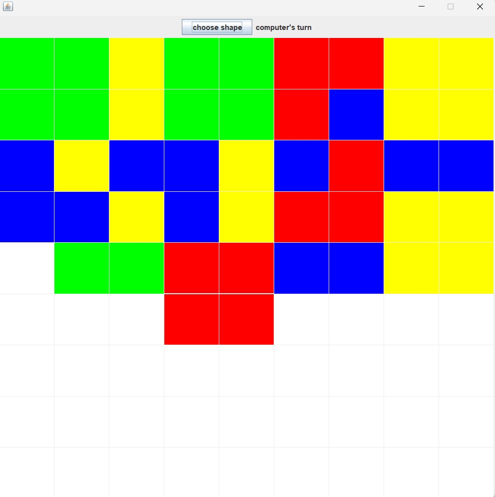

# JavaSwing1

This project allows you to place tiles of different colors and shapes on a grid.

As soon as you run this project, you can see four different options of colors and four different choices of shapes. 

"select" buttons are to select a color and a shape for a tile.
"rotate" buttons are to change the orientation of a shape.

After selection of both a color and a shape, you will be taken to the grid to place your tile. 

